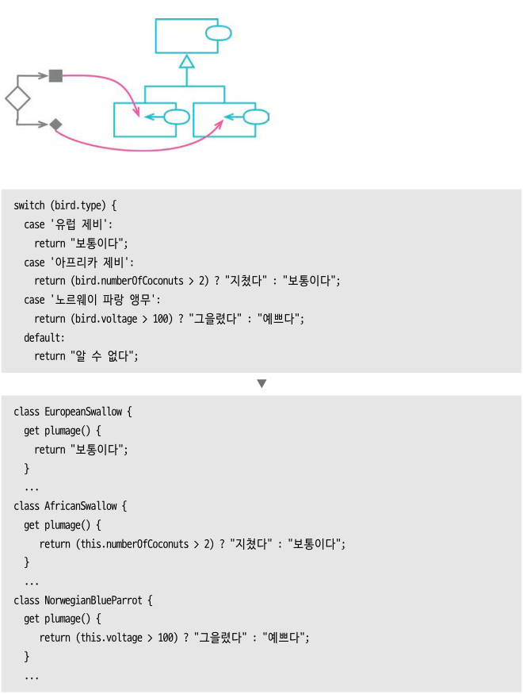

# chapter 10 조건부 로직 간소화
***
조건부 로직은 프로그램의 힘을 강화하는 데 크게 기여하지만, 한편으론 프로그램을 복잡하게 만드는 주요 원흉이기도 하다. 그렇기에 우리는 조건부 로직을 이해하기 쉽게 바꾸는 리팩터링이 필요하다.

- **복잡한 조건문에는** `조건문 분해하기`
- **논리적 조합을 명확하게 다듬는 데는** `중복 조건식 통합하기`
- **핵심 로직에 들어가기 앞서 무언가를 검사해야할 때** `중첩 조건문을 보호 구문으로 바꾸기`
- **똑같은 분기 로직(주로 switch문)이 여러 곳에 등장** `조건부 로직을 다형성으로 바꾸기`
- **널(null)과 같은 특이 케이스를 처리하는 로직이 중복될 때** `특이 케이스 추가하기`
- **프로그램의 상태 확인 후 결과에 따라 다르게 동작해야할 때** `어서션 추가하기`
- **제어 플래그를 통해 코드 동작 흐름을 변경할 때** `제어 플래그를 탈출문으로 바꾸기`
***
## 10.1 조건문 분해하기(Decompose Conditional)


### 배경
    - 다양한 조건, 그에 따라 동작도 다양한 코드를 작성하면 꽤 긴 함수가 탄생하여 읽기 어렵게 된다.
    - 거대한 조건식과 그 조건식에 딸린 조건절을 각각 함수로 추출하는 리팩터링이 필요하다.

### 절차
    1. 조건식과 그 조건식에 딸린 조건절 각각을 함수로 추출한다.

### 효과
    - 해당 조건이 무엇인지 강조하고, 무엇을 분기했는지 명확해진다

### 예시
```javascript
// 기존 코드
if (!aDate.isBefore(plan.summerStart) && !aDate.isAfter(plan.summerEnd)) {
  charge = quantity * plan.summerRate;
} else {
  charge = quantity * plan.reqularRate + plan.reqularServiceCharge;
}

// 리팩토링
function summer() {
  return !aDate.isBefore(plan.summerStart) && !aDate.isAfter(plan.summerEnd);
}

function summerCharge() {
  return quantity * plan.summerRate;
}

function regularCharge() {
  return quantity * plan.reqularRate + plan.reqularServiceCharge;
}

if (summer()) {
  charge = summerCharge();
} else {
  charge = regularCharge();
}

charge = summer() ? summerCharge() : regularCharge();
```
***
## 10.2 조건식 통합하기(Consolidate Conditional Expression)


### 배경
    - 비교하는 조건은 다르지만 동작은 똑같은 경우 조건 검사도 하나로 통합하는게 낫다.
    
### 절차
    1. 해당 조건식들 모두에 부수효과가 없는지 확인
        1. 부수효과 有 ⇒ `질의 함수와 변경 함수 분리하기` 먼저 적용
    2. 조건문 두 개를 선택하여 두 조건문의 조건식들을 논리 연산자로 결합
    3. 테스트 진행
    4. 조건이 하나만 남을 때까지 반복
    5. 통합된 조건식을 함수로 추출할지 고려

### 효과
    - 여러 조각으로 나뉜 조건들을 통합하여 코드의 의도가 더 명확해진다.
    - 이 리팩터링을 통해 함수 추출하기(6.1) 까지 이어 질 수 있다.

### 예시
```javascript
/**
 * 리팩토링 전
 */
if (anEmployee.seniority < 2) return 0;
if (anEmployee.monthDisabled > 12) return 0;
if (anEmployee.isPartTime) return 0;


/**
 * 리팩토링 후
 */
if (isNotEligibleForDisability()) return 0;


function isNotEligibleForDisability() {
  return (
      anEmployee.seniority < 2 ||
      anEmployee.monthDisabled < 12 ||
      anEmployee.isPartTime
  );
}
```
***
## 10.3 중첩 조건문을 보호 구문으로 바꾸기(Replace Nested Conditional with Guard Clauses)


### 배경
    - 조건문은 주로 두 가지 형태로 쓰인다.
        1. 참인 경로와 거짓인 경로 모두 정상 동작으로 이어지는 형태
            - 두 경로 모두 정상 동작이라면 `if-else` 절을 사용한다.
        2. 두 경로 중 한 쪽만 정상인 형태
            - 한 쪽만 정상이라면 비정상 조건을 `if` 문으로 검사한다.
            - 조건이 참이면 (비정상이면) 함수에서 빠져나온다.
            - 이러한 형태를 흔히 **보호 구문(Guard Clause)** 라고 한다.
        - 두 형태는 의도하는 바가 서로 다르므로 그 의도가 코드에 드러나야 한다.
    - 이 리팩터링의 핵심은 의도를 부각하는 데 있다.
        - 보호 구문을 통해,
          **” 이건 이 함수의 핵심이 아니니, 이 일이 일어나면 무언가 조치를 취한 후 빠져나온다 “** 와 같은 메세지를 전한다.

### 절차
    1. 교체해야 할 조건 중 가장 바깥 것을 선택하여 보호 구문으로 바꾼다.
    2. 테스트한다.
    3. 1~2 과정을 반복한다.
    4. 모든 보호 구문이 같은 결과를 반환한다면 보호 구문들에 대해 `조건식 통합`을 적용한다.

### 효과
    - 보호 구문을 통해 함수의 핵심 로직이 아닌 부분을 명확히 구분하고 불필요한 복잡도를 줄인다.

### 예시
```javascript
/**
 * 리팩토링 전
 */
function getPayAmount() {
  let result;
  if (isDead) {
    result = deadAmount();
  } else {
    if (isSeparated) {
      result = separateAmount();
    } else {
      if (isRetired) {
        result = retiredAmount();
      } else {
        result = normalPayAmount();
      }
    }
  }
}

/**
 * 리팩토링 후
 */
function getPayAmount() {
  if (isDead) return deadAmount();
  if (isSeparated) return separateAmount();
  if (isRetired) return retiredAmount();
  return normalPayAmount();
}
```
***
## 10.4 조건부 로직을 다형성으로 바꾸기(Replace Conditional with Polymorphism)


### 배경
    - 조건부 로직을 직관적으로 구조화 하는 방법으로 클래스와 다형성을 이용하는 방법이다.
        1. 타입을 여러 개 만들고 각 타입이 자신만의 조건부 로직을 처리하도록 구성
        2. 기본 동작을 위한 case문과 그 변형 동작으로 구성된 로직
            1. 기본 동작은 슈퍼클래스에 넣고,
            2. 변형 동작을 뜻하는 case들을 각각의 서브클래스로 구성
    - `if-else` , `switch-case` 문으로 처리하기 복잡한 조건부 로직에 대해,
      OOP의 핵심인 다형성을 이용하도록 하자.

### 절차
    1. 다형적 동작을 표현하는 클래스들을 만들어준다.
       이왕이면 적합한 인스턴스를 알아서 만들어 반환하는 팩터리 함수도 함께 만든다.
    2. 호출하는 코드에서 팩터리 함수를 사용하게 한다.
    3. 조건부 로직 함수를 슈퍼클래스로 옮긴다.
        1. 조건부 로직이 온전한 함수로 분리되어 있지 않다면 먼저 함수로 추출
    4. 서브클래스 중 하나를 선택,
       슈퍼클래스의 조건부 로직 메서드를 오버라이드한다.
        1. 조건부 문장 중 선택된 서브클래스에 해당하는 조건절을
           서브클래스 메서드로 복사한 다음 적절히 수정한다.
    5. 같은 방식으로 각 조건절을 해당 서브클래스에서 메서드로 구현
    6. 슈퍼클래스 메서드에는 기본 동작 부분만 남긴다.
        1. 슈퍼클래스가 추상 클래스여야 한다면,
           이 메서드를 추상으로 선언하거나 서브클래스에서 처리해야 함을 알리는 에러를 던진다.

### 효과
    - 기본 로직을 슈퍼클래스로 넣어서 서브클래스의 변형 동작에 신경 쓰지 않고 기본에 집중하게 할수 있게 한다.
    - switch 로직의 중복을 없앨 수 있다.

### 예시
```javascript
/**
 * 리팩토링 전
 */
switch (bird.type) {
  case '유럽 제비':
    return '보통이다';
  case '아프리카 제비':
    return bird.numberOfCoconuts > 2 ? '지쳤다' : '보통이다';
  case '노르웨이 파랑 앵무':
    return bird.voltage > 100 ? '그을렸다' : '예쁘다';
  default:
    return '알 수 없다';
}

/**
 * 리팩토링 후
 */
class EuropeanSwallow {
  get plumage() {
    return '보통이다';
  }
  ...
}

class AfricanSwallow {
  get plumage() {
    return this.numberOfCoconuts > 2 ? '지쳤다' : '보통이다';
  }
  ...
}

class NorwegianBlueParrot {
  get plumage() {
    return this.voltage > 100 ? '그을렸다' : '예쁘다';
  }
  ...
}
```
***
## 10.5 특이 케이스 추가하기(Introduce Special Case)


### 배경
    - 코드베이스에서 특정 값에 대해 똑같이 반응하는 코드가 여러 곳이라면,
      그 반응들을 한 데로 모으는 게 효율적이다.
    - 특수한 경우의 공통 동작을 요소 하나에 모아서 사용하는 `특이 케이스 패턴`은,
      바로 이럴 때 적용하면 좋은 매커니즘이다.
        - 이 패턴을 활용하면 특이 케이스를 확인하는 코드 대부분을
          단순한 함수 호출로 바꿀 수 있다.
    - 널(null)은 특이 케이스로 처리해야 할 때가 많다.
        - 그래서 이 패턴을 `널 객체 패턴, Null Object Pattern` 이라고도 한다.

### 절차
    - 이번 리팩터링의 대상이 될 속성을 담은 데이터 구조(혹은 클래스)를 컨테이너라고 하자.
    - 컨테이너를 사용하는 코드에서는 해당 속성이 특이한 값인지를 검사한다.
    - 우리는 이 대상이 가질 수 있는 값 중 특별하게 다뤄야 할 값을 **특이 케이스 클래스**로 대체하고자 한다.

    1. 컨테이너에 특이 케이스인지를 검사하는 속성을 추가하고, `false`를 반환하게 한다.
    2. 특이 케이스 객체를 만든다.
       이 객체는 특이 케이스인지를 검사하는 속성만 포함하며,
       이 속성은 `true`를 반환하게 한다.
    3. 클라이언트에서 특이 케이스인지를 검사하는 코드를 함수로 추출한다.
       모든 클라이언트가 값을 직접 비교하는 대신 방금 추출한 함수를 사용하도록 고친다.
    4. 코드에 새로운 특이 케이스 대상을 추가한다.
       함수의 반환 값으로 받거나 변환 함수를 적용하면 된다.
    5. 특이 케이스를 검사하는 함수 본문을 수정하여 특이 케이스 객체의 속성을 사용하도록 한다.
    6. 테스트 한다.
    7. `여러 함수를 클래스로 묶기` or `여러 함수를 변환 함수로 묶기` 를 적용하여,
       특이 케이스를 처리하는 공통 동작을 새로운 요소로 옮긴다.
    8. 아직도 특이 케이스 검사 함수를 이용하는 곳이 남아 있다면 검사 함수를 인라인한다.

### 효과
    - 특이 케이스를 확인하고 처리하는 코드를 한 데 모아 효율적으로 관리할 수 있다.

### 예시
```javascript
/**
 * 리팩토링 전
 */
if (aCustomer === '미확인 고객') customerName = '거주자';

/**
 * 리팩토링 후
 */
class UnknownCustomer {
  get name() {
    return '거주자';
  }
}
```
***
## 10.6 어서션 추가하기(Introduce Assertion)


### 배경
    - 특정 조건이 참일 때만 제대로 동작하는 코드 영역에 대한 사전 검사 용도
        - 특정 조건이 **항상 참이라고 가정하는 조건부 문장**으로서의 역할을 하는 것이다.
        - 또한, 로직의 흐름이 어떤 상태임을 가정한 채 실행되고 있는지를 다른 개발자에게 알려주는 훌륭한 소통 도구로서의 역할도 할 수 있다.
        - **디버깅하기도 편하고 소통 수단으로서의 가치도 있다는 것**
    - 어서션이 있고 없고가 프로그램 기능의 정상 동작에 아무런 영향을 주지 않도록 작성돼야 한다.

### 절차
    1. 참이라고 가정하는 조건이 보이면 그 조건을 명시하는 어서션을 추가한다.

### 효과
    - 프로그램이 어떤 상태임을 가정한 채 실행되는지를 다른 개발자에게 알려주는 훌륭한 소통 도구가 된다.
    - 단, 테스트 코드가 있다면 어서션의 디버깅 용도로서의 효용은 줄어든다.

### 예시
```javascript
/**
 * 리팩토링 전
 */
if (this.discountRate) base = base - this.discountRate * base;

/**
 * 리팩토링 후
 */
assert(this.discountRate >= 0);
if (this.discountRate) base = base - this.discountRate * base;

```

### 주의
    - 어서션을 남발하는 것 역시 위험하다.
        - **반드시 참이어야 하는 것**만 검사해야한다.
        - 프로그래머가 일으킬만한 오류에만 어서션을 사용.
    - 이러한 종류의 조건(가정)은 미세하게 자주 조정되기 때문에 중복된 코드가 있다면 큰 문제가 된다.
        - 반드시 중복은 남김없이 제거해야 한다.

***
## 10.7 제어 플래그를 탈출문으로 바꾸기(Replace Control Flag with Break)


### 배경
    - 제어 플래그란 코드의 동작을 변경하는 데 사용되는 변수를 말한다.
        - 제어 플래그의 주 서식지는 반복문 안이다.
        - 저자는 제어 플래그를 악취로 생각한다.

### 절차
    1. 제어 플래그를 사용하는 코드를 함수로 추출할지 고려한다.
    2. 제어 플래그를 갱신하는 코드 각각을 적절한 제어문으로 바꾼다.
        1. 하나 바꿀 때마다 테스트 진행
    3. 모두 수정했다면 제어 플래그를 제거

### 효과
    - 불필요하게 복잡하게 작성된 코드를 간소화 한다.

### 예시
```javascript
/**
 * 리팩토링 전
 */
for (const p of people) {
  if (!found) {
    if (p === '조커') {
      sendAlert();
      found = true;
    }
  }
}

/**
 * 리팩토링 후
 */
for (const p of people) {
  if (p === '조커') {
    sendAlert();
    break;
  }
}
```