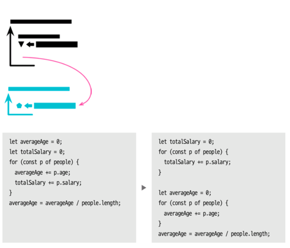
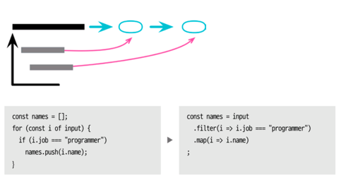
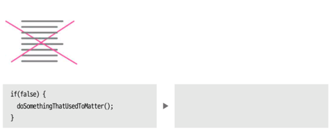

# chapter 8 기능 이동
***
- 지금까지(6~7장) 프로그램 요소를 생성 혹은 제거하거나 이름을 변경하는 리팩터링
- 8장 => 다른 요소를 다른 컨텍스트(클래스나 모듈 등)로 옮기는 일
    - 함수 옮기기(8.1)
    - 필드 옮기기(8.2)
- 옮기기는 문장 단위에서도 이뤄진다.
    - 문장을 함수 안이나 바깥으로 옮길 때
        - 문장을 함수로 옮기기(8.3)
        - 문장을 호출한 곳으로 옮기기(8.4)
    - 한 덩어리의 문장들이 기존 함수와 같은 일을 할 때
      - 인라인 코드를 함수 호출로 바꾸기(8.5)
    - 같은 함수 안에서 옮길 때
        - 문장 슬라이드하기(8.6)
- 반복문 관련 리팩터링
    - 반복문 쪼개기(8.7)
    - 반복문 파이프라인으로 바꾸기(8.8)
- 죽은 코드 제거하기(8.9)
***
## 8.7 반복문 쪼개기(Split Loop)


### 배경 
- 그저 두 일을 한꺼번에 처리할 수 있다는 이유로 한 반복문에서 두 가지 일을 수행하는 경우가 있다.
- 하지만 이렇게 하면 반복문을 수정할 때마다 두 가지 일 모두를 잘 이해하고 진행해야하는 문제가 있다.
- 서로 다른 일들이 한 함수에서 이뤄지고 있다는 신호일 수 있고, 반복문 쪼개기와 함수 추출하기를 연이어 수행하는 일이 잦다.

### 적용시점
- 반복문에서 두 가지 일을 수행하는 경우
- 반복문을 두 번 실행해야 하므로 이 리팩터링을 불편해 하는 프로그래머도 많지만 리팩터링과 최적화를 구분하자.
  - 최적화는 코드를 깔끔하게 정리한 이후에 수행하자.
  - 반복문을 두 번 실행하는게 병목이라 밝혀지면 그때 다시 하나로 합치기는 식은 죽 먹기다.
  - 실제 긴 리스트를 반복하더라도 병목으로 이어지는 경우는 매우 드물다.
  - 오히려 반복문 쪼개기를 통해 다른 최적화를 적용할 가능성이 높아진다.

### 절차
- 반복문을 복제해 두 개로 만든다.
- 반복문이 중복되어 생기는 부수효과를 파악해서 제거한다.
    - 부수효과가 있는 코드는 한쪽만 남기고 제거
- 테스트한다.
- 각 반복문을 함수로 추출할 지 고민한다.

### 효과
- 반복문을 분리하면 수정할 동작 하나만 이해하면 된다

### 예시
```javascript
// 전체 급여와 가장 어린 나이를 계산하는 코드
function report(people) {
  let youngest = people[0] ? people[0].age : Infinity;
  let totalSalary = 0;
  for (const p of people) {
    if (p.age < youngest) youngest = p.age;
    totalSalary += p.salary;
  }
  return `youngestAge: ${youngest}, totalSalary: ${totalSalary}`;
}

function report(people) {
  let youngest = people[0] ? people[0].age : Infinity;
  let totalSalary = 0;
  // 반복문 복제 후 중복제거
  for (const p of people) {
    if (p.age < youngest) youngest = p.age;
    // totalSalary += p.salary;
  }
  for (const p of people) {
    // if (p.age < youngest) youngest = p.age;
    totalSalary += p.salary;
  }
  return `youngestAge: ${youngest}, totalSalary: ${totalSalary}`;
}

function youngestAge(people) {
  let youngest = people[0] ? people[0].age : Infinity;
  for (const p of people) {
    if (p.age < youngest) youngest = p.age;
  }
  return youngest;
}

function totalSalary(people) {
  let totalSalary = 0;
  for (const p of people) {
    totalSalary += p.salary;
  }
  return totalSalary;
}

function report(people) {
  // 문장 슬라이드 후 반복문을 함수로 추출
  // 인라인하기
  return `youngestAge: ${youngestAge(people)}, totalSalary: ${totalSalary(people)}`;
}

// 알고리즘 교체하기
function youngestAge(people) {
  return Math.min(...people.map(p => p.age));
}

// 반복문을 파이프라인으로 바꾸기
function totalSalary(people) {
  return people.reduce((total, p) => total + p.salary, 0);
}

module.exports = {report}
```
[reduce()](https://velog.io/@lemuel0525/%ED%95%A8%EC%88%98-reduce)
***
## 8.8 반복문을 파이프라인으로 바꾸기(Replace Loop with Pipeline)


### 배경
- 컬렉션을 순회할 때 반복문이 아닌 컬렉션 파이프라인을 사용할 수 있도록 언어는 발전했다.
- 이를 이용하면 처리 과정을 일련의 연산으로 표현할 수 있다.

### 적용시점
- 파이프라인으로 교체 가능한 컬렉션 반복문이 있을 경우 (반복문 쪼개기가 선행되어야 함)

### 절차
- 반복문에서 사용하는 컬랙션을 가리키는 변수를 하나 만든다.
- 반복문의 첫 줄부터 시작해서 각 줄을 적절한 컬렉션 파이프라인으로 대체한다.
    - 위에서 만든 컬렉션 변수로부터 시작된다.
    - 하나씩 대체할 때마다 테스트한다.
- 반복문의 모든 동작을 대체했다면 반복문을 지운다.

### 효과
- 논리를 파이프라인으로 표현하면 이해하기 훨씬 쉬워진다.

### 예시

```javascript
// 다음 함수는 인도(India)에 자리한 사무실을 찾아서 도시명과 전화번호를 반환한다.
function acquireData(input) {
  const lines = input.split("\n");
  let firstLine = true;
  const result = [];
  for (const line of lines) {
    if (firstLine) {
      firstLine = false;
      continue;
    }
    if (line.trim() === "") continue;
    const record = line.split(",");
    if (record[1].trim() === "India") {
      result.push({city: record[0].trim(), phone: record[2].trim()});
    }
  }
  return result;
}

function acquireData(input) {
  const lines = input.split("\n");
  // slice 함수로 대체
  // let firstLine = true;
  const result = [];
  // 루프 변수 만들기
  // 첫 번째 줄을 건너 뛰기 위해 slice
  const loopItems = lines.slice(1);
  for (const line of loopItems) {
    /* slice 함수로 대체
    if (firstLine) {
      firstLine = false;
      continue;
    }
    */
    if (line.trim() === "") continue;
    const record = line.split(",");
    if (record[1].trim() === "India") {
      result.push({city: record[0].trim(), phone: record[2].trim()});
    }
  }
  return result;
}

function acquireData(input) {
  const lines = input.split("\n");
  const result = [];
  const loopItems = lines
      .slice(1)
      .filter(line => line.trim() !== "")
      .map(line => line.split(','))
      .filter(record => record[1].trim() === "India")
  ;
  for (const line of loopItems) {
    // 빈 줄을 제거하는 로직을 filter함수로 대체
    // if (line.trim() === "") continue;

    // map함수로 대체
    // const record = line.split(",");
    const record = line;

    // filter함수로 대체
    // if (record[1].trim() === "India") {
    result.push({city: record[0].trim(), phone: record[2].trim()});
    // }
  }
  return result;
}

function acquireData(input) {
  const lines = input.split("\n");
  const result = [];
  const loopItems = lines
      .slice(1)
      .filter(line => line.trim() !== "")
      .map(line => line.split(','))
      .filter(record => record[1].trim() === "India")
      .map(record => ({city: record[0].trim(), phone: record[2].trim()}))
  ;
  for (const line of loopItems) {
    const record = line;
    // 결과 레코드를 map 함수로 대체
    result.push(line);
  }
  return result;
}

function acquireData(input) {
  const lines = input.split("\n");
  // const result = [];
  // const loopItems = lines
  const result = lines
      .slice(1)
      .filter(line => line.trim() !== "")
      .map(line => line.split(','))
      .filter(record => record[1].trim() === "India")
      .map(record => ({city: record[0].trim(), phone: record[2].trim()}))
  ;
  /*
  for (const line of loopItems) {
    const record = line;
    result.push(line);
  }
  */
  return result;
}

// 코드 정리
function acquireData(input) {
  const lines = input.split("\n");
  return lines
      .slice(1)
      .filter(line => line.trim() !== "")
      .map(line => line.split(','))
      .filter(record => record[1].trim() === "India")
      .map(record => ({city: record[0].trim(), phone: record[2].trim()}))
      ;
}

module.exports = {acquireData}
```
***
## 8.9 죽은 코드 제거하기(Remove Dead Code)


### 배경
- 사용되지 않는 코드는 소프트웨어의 동작을 이해하는 데 커다란 장애물이 될 수 있다.
- 사용되지 않는 코드는 지우자.
- 버전 관리 시스템(git)이 있으므로 코드를 주석 처리하는 방식으로 할 필요가 전혀 없다.

### 적용시점
- 주석 처리된 코드가 있는 경우
- 안쓰이는 코드가 있는 경우

### 절차
- 죽은 코드를 외부에서 참조할 수 있는 경우라면 호출하는 곳이 있는지 확인한다.
- 없는 것이 확인되면 죽은 코드를 제거한다.
- 테스트한다.

### 효과
- 죽은 코드 임에도 코드가 남아있으면 운 나쁜 프로그래머가 이 코드의 동작을 이해하려고 한다거나 
- 코드를 수정했는데도 기대한 결과가 나오지 않는 이유를 파악하기 위해 시간을 허비하는 상황을 막을 수 있다.

>[[git] 과거로 갔다가 돌아 오기 (특정 리비전으로 갔다가 되돌아 오기)](https://mytory.net/archives/10078)
